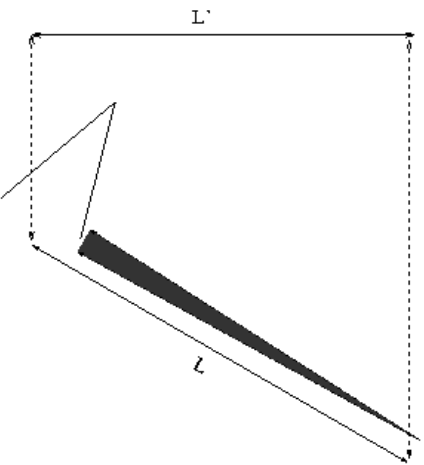

.. _r01-measuring-moon-mountains:

R01: Measuring Mountains on the Moon
====================================

For a feature on the moon, you can measure its height from the shadow it casts using the following procedure

Physical Dimensions of the Shadows:
-----------------------------------

Begin by measuring shadows cast by features that you see in your images.

#. Measure the length in pixels of the shadows from the peak of a mountain or crater rim to the end of the shadow it casts (typical lengths will be 7 to 30 pixels or so). The "Ruler" Region in ds9 can be helpful for this task.

#. Use the pixel scale of the camera to convert these lengths into km using trigonometry. You'll need to determine the distance from the Earth to the Moon at the time you took your images to do this; e.g. try using Stellarium.

#. Double check your measurements by measuring and computing the sizes in km of some of the well-defined craters you see in your image and comparing them with the sizes you can find in the Chang'E-1 atlas and on http:\\fullmoonatlas.com. Do your sizes match?

Correcting for foreshortening:
------------------------------

Because the Moon is not flat, you need to correct for the *foreshortening* caused by the curve of the Moons surface away from us. In this diagram, you can see L' is the length that you measured and L is the actual length.

#. Correct the measured shadow length based on the Selenographic longitude (:math:`l`) and latitutde (:math:`b`) of the feature you are looking at by multiplying your measured length by the correction factor given by: :math:`f = 1 \ (\cos l \centerdot \cos b)`

Calculating the height using the Solar Illumination Angle
---------------------------------------------------------

To measure the height from the shadow you need to know the illuminaiton angle from the Sun (as you know... shadows get longer as the Sun gets lower... same for the Moon!!)

#. You need to find the Solar illumination at the time of your observation. You can go to this site: http://www.lunar-occultations.com/rlo/ephemeris.htm and record all relevant values from the time of your observation (In UTC). You need to know the Co-longnitude of the Sun (:math:`Co`) and the sub-solar latitude (:math:`Bo`)

#. Calculate the angle :math:`\theta = \sin^{-1} \{ [ \sin Bo \centerdot \sin b ] + [ \cos Bo \centerdot \cos b \centerdot \sin (Co + l) ] \}`

#. Now, you can calculate the height using the below diagram from the corrected L and the solar angle θ

